# README.md

Created: 2025년 2월 12일 오후 9:39

## 1️⃣ 서비스 소개

### 개요

- 화상 미팅과 게임을 통한 치매 예방과 치매 진단 테스트를 통해 치매 악화 방지 및 예방
- 서비스명 : **TalkTalkCare ( 톡톡케어)**

### 타겟층 🎯

- 치매가 걱정되는 누구나🫂
- 50-80대 외로움있는 노인들👳🧓

### UCC 📽️

- 영상 만들면 추가하면 좋을 듯

## 2️⃣기획 배경

### 배경

- 치매가 걱정되는 우리 할머니😢 내가 매일 돌봐드릴 순 없으니 다른 좋은 방법이 있을까❓
- 요새 좀 깜빡깜빡 하는 것 같다. 혹시 나는 치매 초기인가❓
- 치매가 올까봐 무섭다😨 예방하려면 어떻게 해야할까❓
- 조발성 치매 환자 증가‼️
- 독거노인 수 증가‼️
- 그렇게 치매 예방과 조기 진단을 돕고, 가족과 사회가 함께 치매를 극복할 수 있도록 **TalkTalkCare**가 탄생했습니다!

### 목적 ✅

치매 예방과 더불어 어르신들의 적적함을 달래주자 ‼️

## 3️⃣화면 소개

### 📌회원 가입

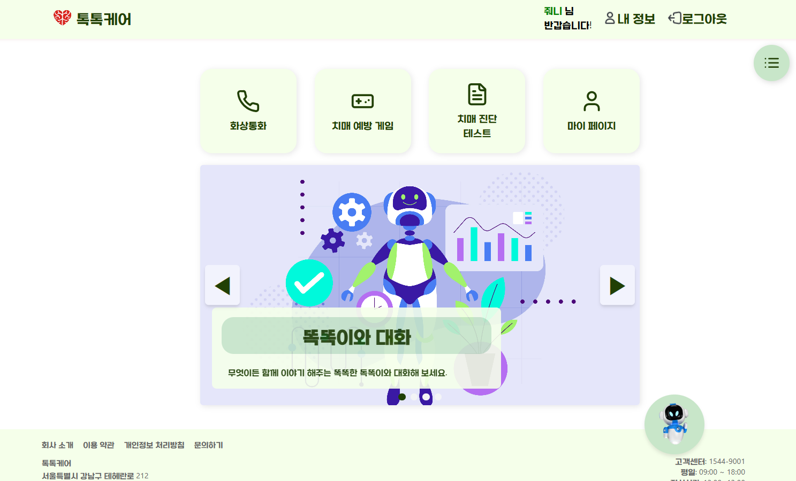

### 📌메인 화면

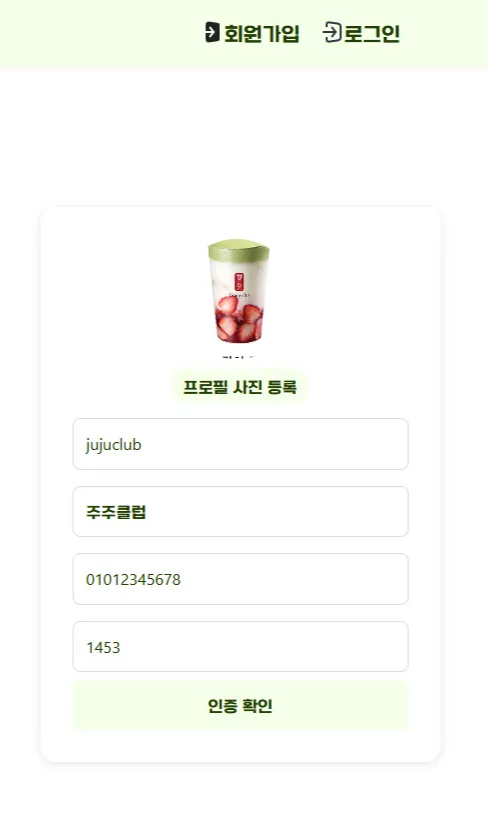

### 📌화상 통화

1. 화상 통화 화면
2. 통화 신청이 왔을 경우 
3. 화상 통화 중

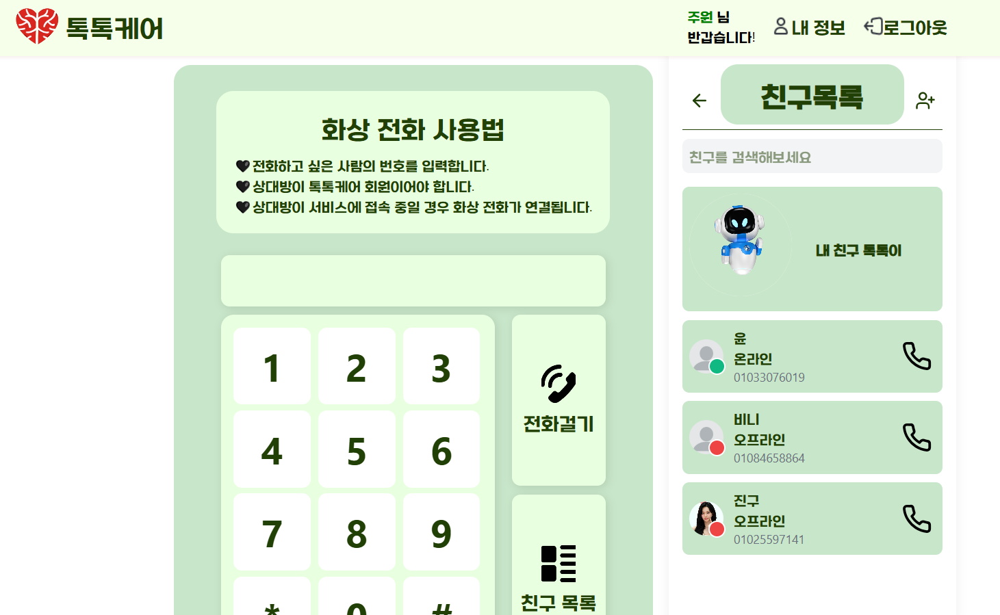

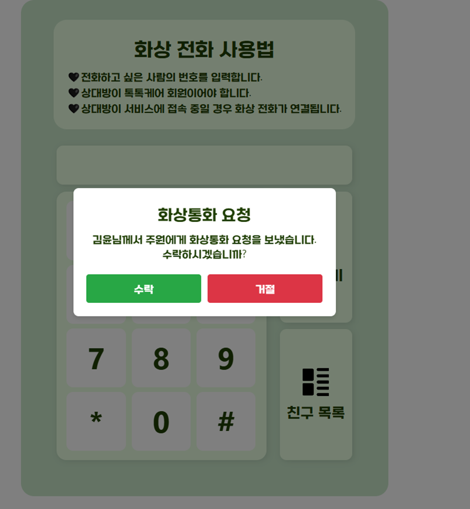

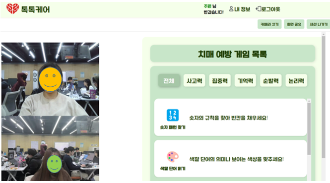

### 📌치매 예방 게임

1. 게임 목록
2. 게임 선택 시
3. 게임 중

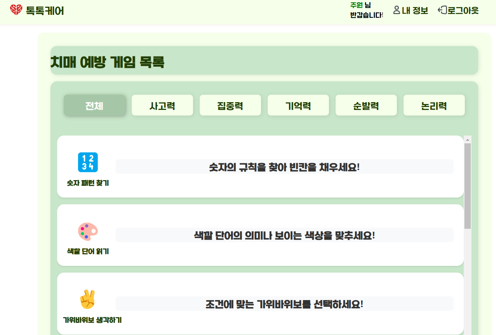

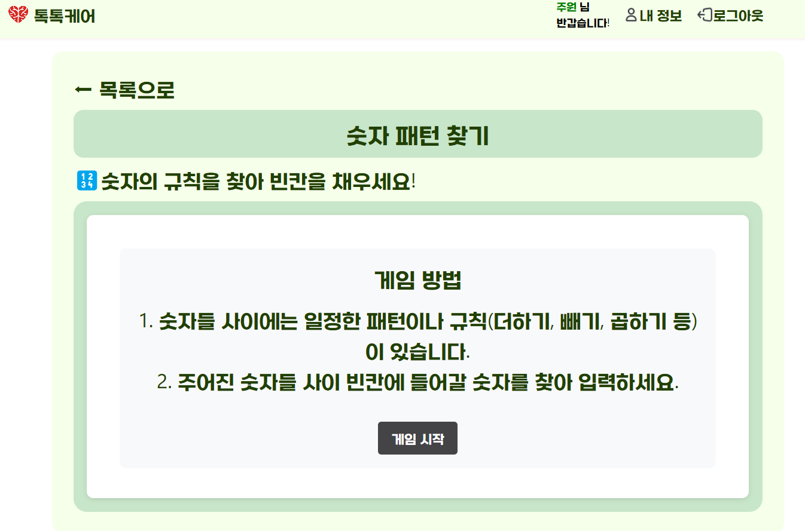

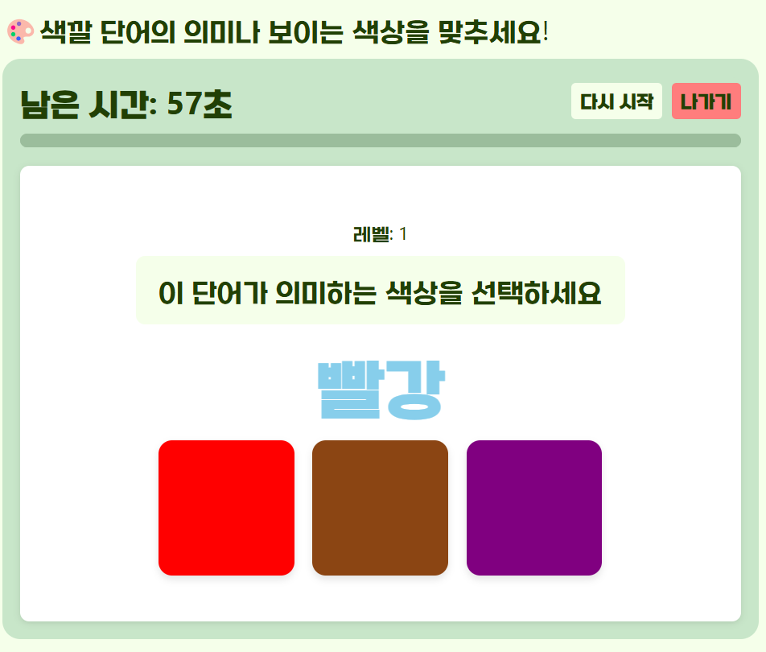

### 📌치매 진단 테스트
1. 테스트 목록
2. 테스트 항목
3. 테스트 결과 (AI 분석 요청 포함)
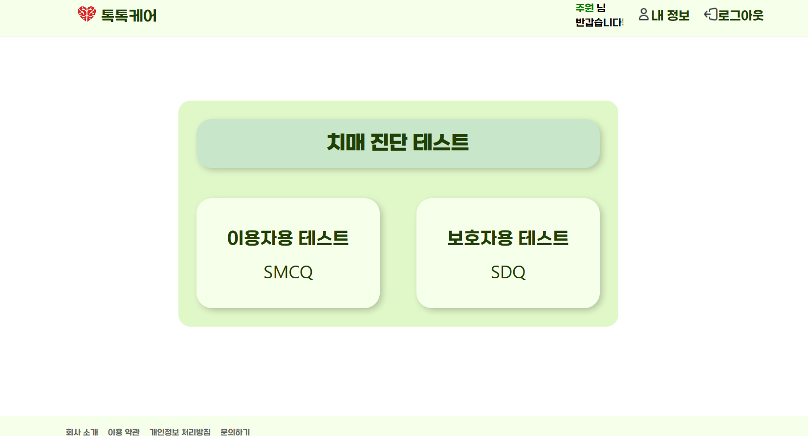

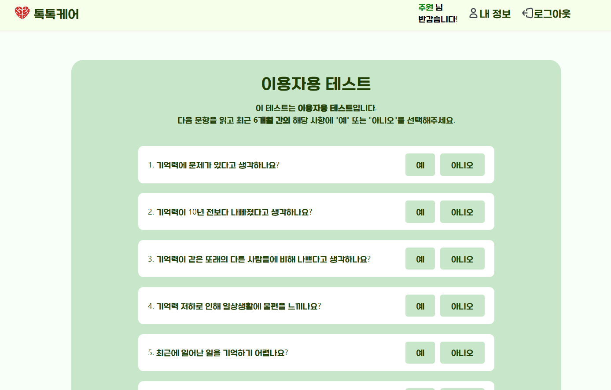

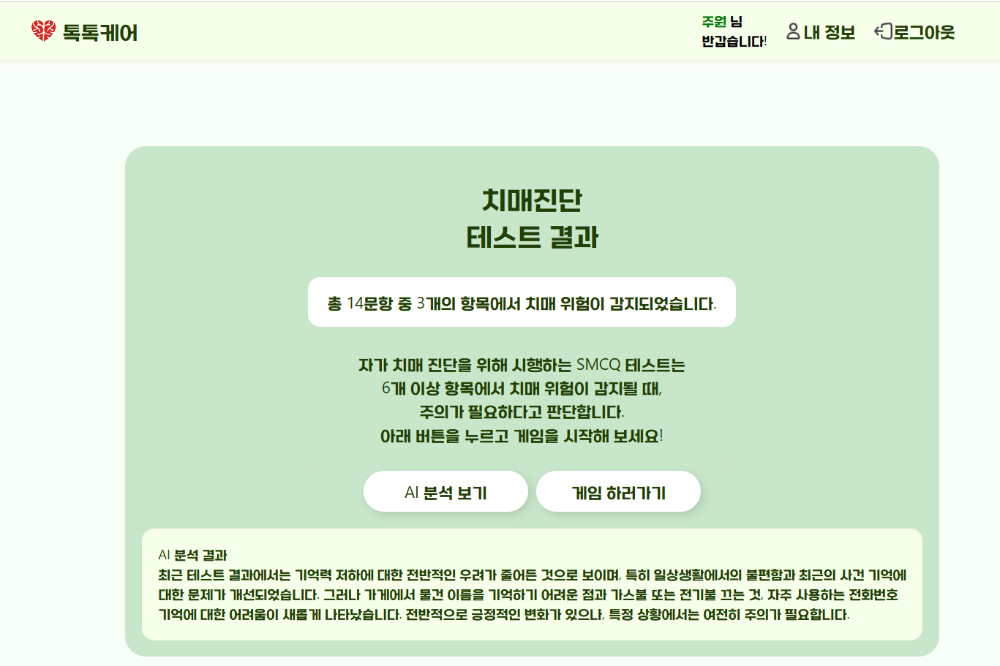

### 📌마이페이지
1. 게임 결과 분석 
2. 치매  진단 테스트 결과 분석

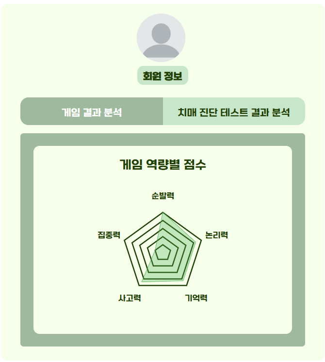

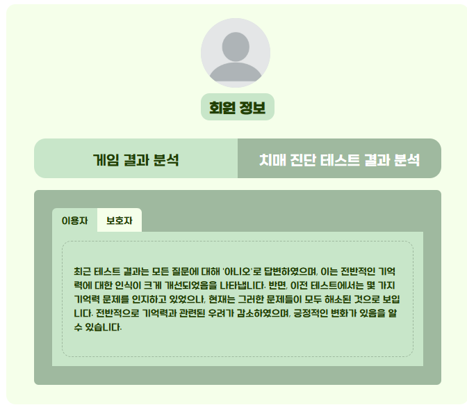

## 4️⃣기술 스택

### BackEnd

- Java
- Spring Boot
- MySQL
- Redis
- WebRTC
- openvidu
- Web Socket
- Amazon S3

### Frontend

- React
- TypeScript
- Tailwind CSS

### Infrastructure

- Gitlab Actions
- Nignx
- Docker
- Amazon EC2

## 5️⃣서비스 아키텍처

## 6️⃣프로젝트 산출물

### 📌 ERD

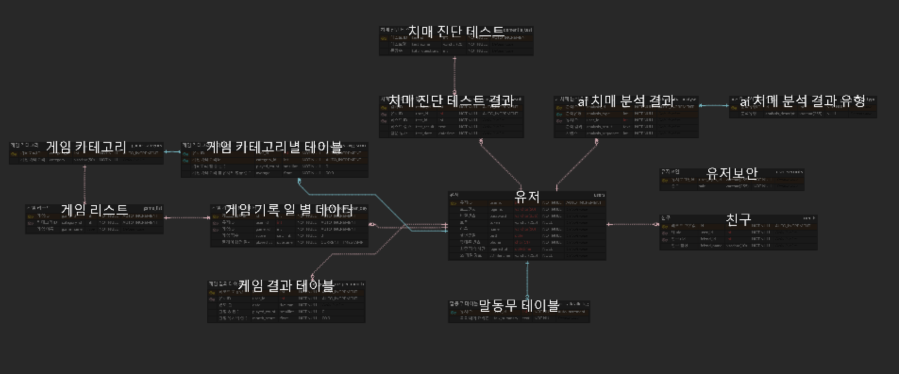

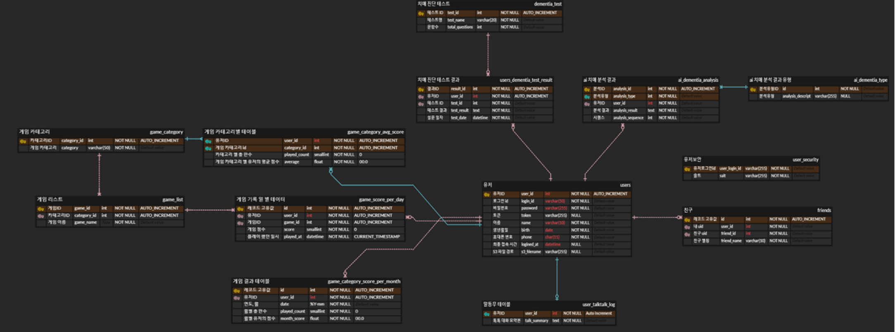

### 📌 Flow chart

### 📌Figma

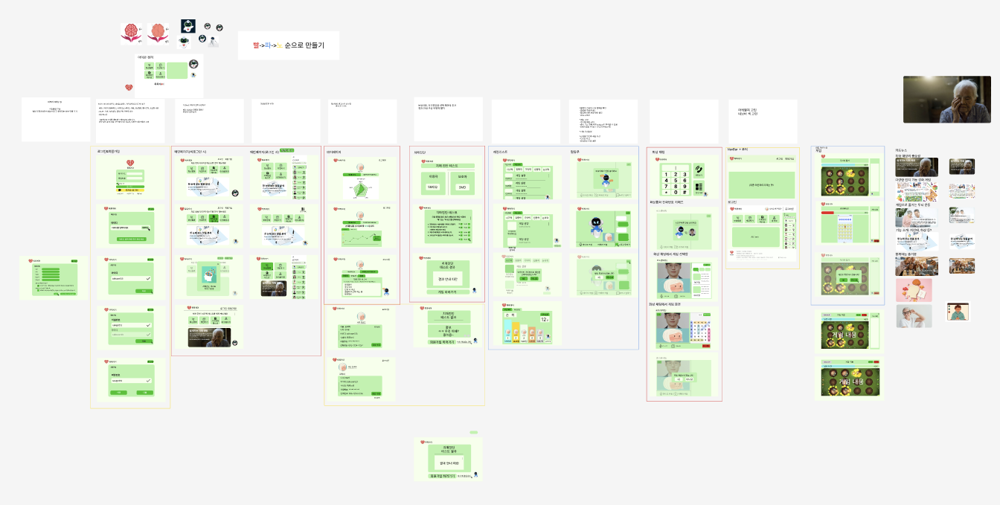

### 📌 API 문서

