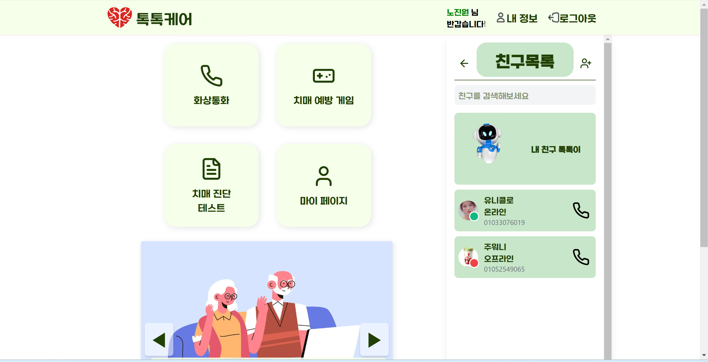
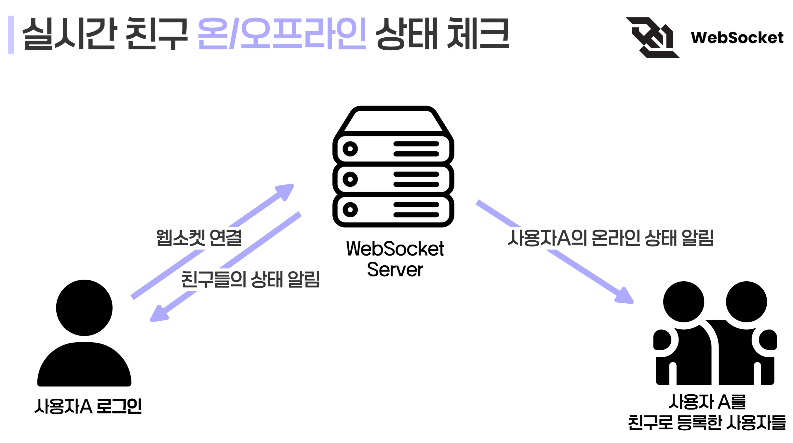
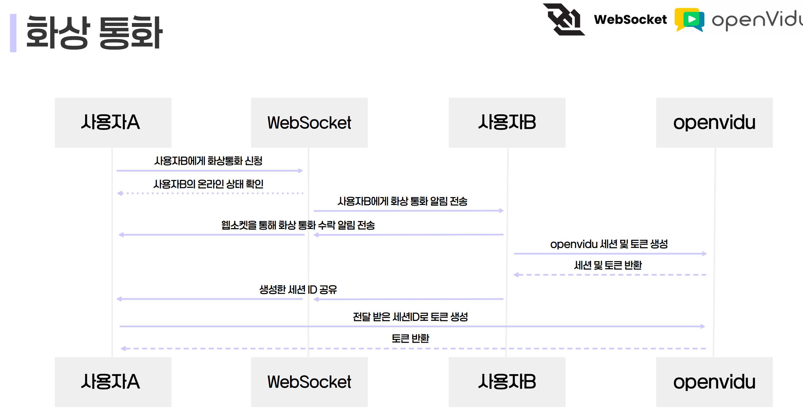
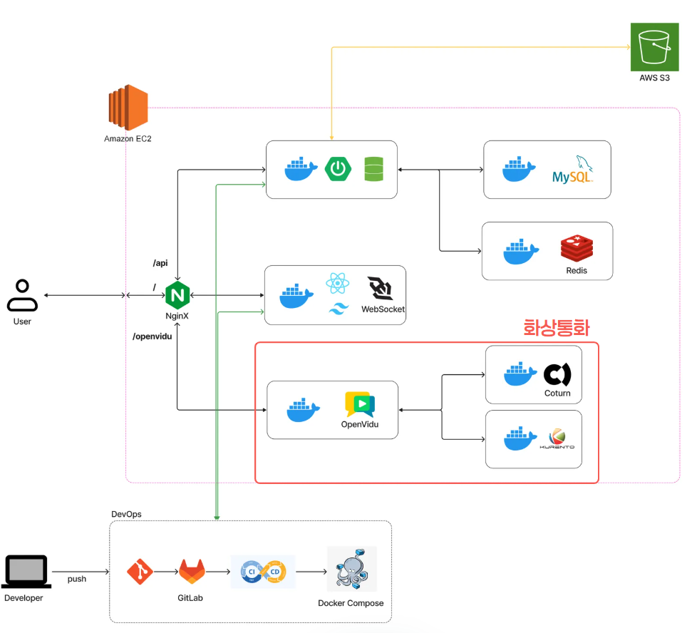
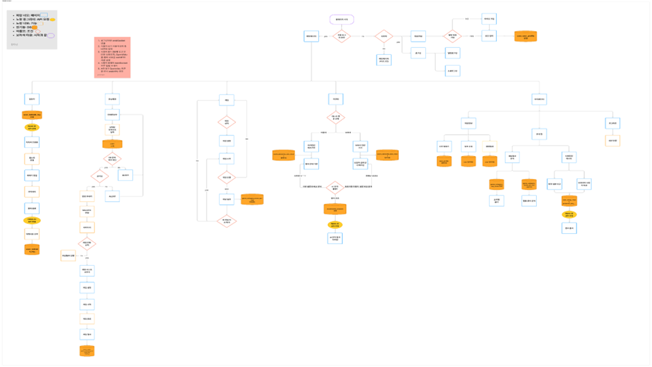

# TalkTalkCare

## 1️⃣ 서비스 소개

### 개요

- 화상 미팅과 게임을 통한 치매 예방과 치매 진단 테스트를 통해 치매 악화 방지 및 예방
- 서비스명 : **TalkTalkCare ( 톡톡케어)**

### 타겟층 🎯

- 치매가 걱정되는 누구나🫂
- 50-80대 외로움있는 노인들👳🧓

### UCC 📽️

[톡톡케어](https://drive.google.com/file/d/1yswyQNzEGOZRCsFwHLAnHNfp9EJVNIF2/view?usp=drive_link)

### Presentation 📕
[톡톡케어 PPT](https://www.miricanvas.com/v/148tyh4)

 

## 2️⃣기획 배경

### 배경

- 우리 할머니의 치매가 걱정돼요😢 매일 곁에서 돌봐드릴 순 없는데, 좋은 방법이 있을까요❓
- 치매가 올까 봐 두려워요😨 예방하려면 어떻게 해야 할까요❓
- 요즘 자꾸 깜빡깜빡하는데, 혹시 치매 초기일까요? ❓
- 외로움이 치매 위험을 40%나 높인다고 해요. 혼자 사시는 우리 할머니, 괜찮을까요? 😢

👉 그래서 **치매 예방, 조기 진단, 그리고 외로움 해소**까지 돕는 **TalkTalkCare**가 탄생했습니다! 💙

### 목적 ✅

치매 예방과 더불어 어르신들의 적적함을 달래주자 ‼️

 

## 3️⃣기능 소개

### 📌메인 화면

---

### 📌친구 목록
- **웹소켓을 통해 온라인 상태를 실시간 체크**하고, **ConcurrentHashMap**으로 사용자의 웹소켓을 관리합니다
- 로그인 시 즉시 사용자의 온/오프라인 상태가 변경되며, 나를 친구로 등록한 사용자들에게 **웹소켓을 통해 상태 변경 알림**을 보냅니다.

---

### 📌화상 통화
- 친구 목록 또는 화상 통화 UI에서 **온라인 상태의 회원에게** 화상 통화를 걸 수 있습니다.
- 화상 통화 요청은 **웹소켓**을 통해 실시간 전달 됩니다.
- 화상 통화를 하며 동일한 화면에서 함께 게임을 플레이할 수 있어, 노인분들이 가족이나 보호자의 도움을 받으며 게임을 즐길 수 있도록 구현했습니다.

---

### 📌치매 예방 게임
- 치매 예방을 위한 인지 지능 강화 게임을 구현하였습니다.
- 게임 단계별로 난이도와 시간을 조절하여 지속적인 흥미를 유도하며, 비회원도 무료로 이용할 수 있습니다.

---

### 📌치매 진단 테스트
- 치매 진단 테스트는 자가 진단 테스트와 보호자용 테스트 두 가지로 구성됩니다.
- AI는 과거와 현재의 자가 진단 테스트를 결과 분석하고, 자가 진단과 보호자용 테스트를 비교 분석하여 변화를 파악합니다.
- 객관적인 데이터를 기반으로 변화 패턴을 파악하여 치매 악화 여부를 조기에 감지하고 대응할 수 있도록 지원합니다.

---

### 📌마이페이지
- 게임을 할 때마다 사용자의 게임 데이터가 축적되며, 한 달에 한 번 배치 처리를 통해 데이터를 집계합니다.
- 집계된 데이터를 바탕으로 사용자의 능력치를 오각형 그래프로 시각화하여 확인할 수 있습니다.
- 치매 진단 테스트의 AI 분석 결과도 함께 확인할 수 있으며, 자가진단 및 보호자용 테스트와의 비교 분석을 통해 변화 추이를 확인할 수 있습니다.

## 4️⃣기술 스택
### BackEnd
- Java
- Spring Boot
- Spring JPA
- Spring Batch
- MySQL
- Redis
- WebRTC
- openvidu
- Web Socket
- Amazon S3

### Frontend
- React
- TypeScript
- Tailwind CSS

### Infrastructure
- Gitlab Actions
- Nignx
- Docker
- Amazon EC2

## 5️⃣핵심 기술
### ✔️WebSocket

 

### ✔️WebRTC & openvidu

 

### ✔️Spring Batch

 

## 6️⃣서비스 아키텍처

 

## 7️⃣프로젝트 산출물
### 📌 ERD

---

### 📌 Flow chart

---

### 📌Figma

---

### 📌 API 문서

