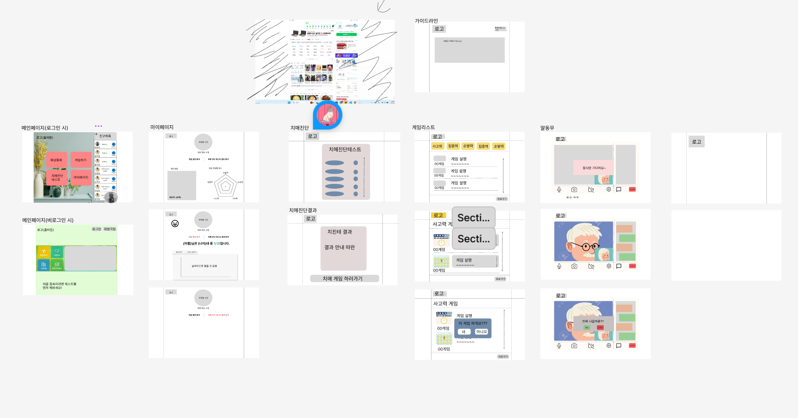

# 프로젝트 명 : 톡톡케어(톡톡하면 똑또케져요!)

# DAY1 25.01.14
## 개요
1. 화상회의와 게임을 통해 치매예방을 할 수 있는 서비스

2. 배경
- 조발성 치매 환자의 증가
- 충분한 정서적 지지를 받지 못하는 노인의 치매 발병률 증가
- 고령화 추세로 치매로 인한 사회적 비용 증가

3. 프로젝트 목표
- 치매예방 관리
- 정서적 지원
- 사용자 친화적인 UI/UX

## 주요 기능
- 요양 보호사와 1:1 화상회의를 통해 진행하는 치매예방 기능
- 화상 통화시 카메로 ON/OFF 기능
- 친숙한 UI
- 혼자서 즐길 수 있는 치매 예방 게임임

### 게임
- 게임 카테고리 : 기억력, 사고력, 집중력, 순발력, 논리력

### 치매 진단 테스트
- SMDQ : 본인이 수행
- SDQ : 보호자가 진행하는 치매 진단 테스트트
- 결과 확인

### 회원 관리
- 회원가입 : SMS 인증을 통해 회원가입       
  - 요양 보호사는 별도의 인증을 통해 권한 부여여
- 로그인/로그아웃       
- 친구 추가/삭제 : 친구 목록 UI는 전화번호부 형태
- 마이페이지 : 회원정보 수정 및 게임 점수, 치매 진단 테스트 결과 확인 가능

# DAY2 25.01.15
## 마이페이지 
- 게임 점수 그래프 (중요도 : 상)
  - 게임 카테코리 별로 획득한 점수를 오각형 그래프에 나타낸다.
  - 상세 기능 : 획득한 게임 점수를 DB에 저장한 뒤에 데이터 값을 Radar chart 라이브러리를 통해 그래프로 구현
  - 필수 데이터
    - 게임점수 -> 게임별 점수, 게임한 날짜, 게임을 한 사람

- 게임 성장 추이 그래프 (중요도 : 상)
  - 게임했던 과거 데이터를 기반으로 성장 추이 그래프에 나타낸다.
  - 게임 플레이한 날짜, 획득한 총점 등을 이용하여 성장 추이 그래프로 구현

- 치매 진단 테스트 (중요도 : 상)
  - 회원가입 후 진행한 치매진단 테스트의 날짜, 검사유형(본인 or 보호자 별로 다른 테스트 진행), 점수를 확인할 수 있다.
  - 상세 기능 : 치매진단 테스트의 데이터를 유형별로 DB에 저장한 뒤 이를 불러와서 화면에 나타낸다.
  - 필수 데이터
    - 테스트 유형 및 항목
    - 진단하는 사람
    - 테스트 날짜
    - 테스트 결과

- 회원 탈퇴 (중요도 : 하)
  - DB에서 회원 정보를 삭제함으로써 회원탈퇴
  - 상세 기능 : 유저 DB에서 회원정보 삭제
  - 필수 데이터
    - 본인 UID

- 회원정보 수정 (중요도 : 하)
  - 마이 페이지에서 닉네임, 휴대전화, 프로필사진, 비밀번호를 수정할 수 있다.
  - 상세 기능 : DB에서 사용자가 수정하고자 하는 정보를 업데이트한다.
  - 필수 데이터
    - 본인 UID, 수정하고자 하는 정보보

# DAY3 25.01.16
## 서비스 주요 기능
### 게임
- 카테고리
  - 집중력, 순발력, 논리력, 사고력, 기억력
  - 각각의 카테고리에 맞는 게임 구상
    - 기억력
      - 카드 뒤집기 게임
      - 순서 기억하기 게임임
    - 사고력
      - 데카르트 가위바위보 게임
      - 방향 및 위치 예측 게임
    - 집중력
      - 색깔 단어 찾기 게임
      - 숫자 추적 게임
    - 순발력
      - 빈 숫자 찾기 게임
      - 두더지 게임
    - 논리력
      - 숫자 or 사칙연산 게임
      - 대소비교 게임
- 특이점
  - 각 게임은 3단계의 난이도를 가진다.
  - 각 단계를 통과하면 해당 난이도에 대한 보상 획득 가능
    - 1단계 : 동(100점), 2단계 : 은(200점), 3단계: 금(300점)
  - 남은 시간에 비례해 똑똑지수 획득 가능
  - 난이도별 차등 리워드를 지급해 시간에 따른 효율성 증대 기대
  - 각 게임에 따라 제한시간이 다르다.
  - 게임 방식은 기본적으로 ***협동 방식***으로 진행한다.
- 랭킹 제도
  - 게임을 통해 얻은 똑똑지수에 따른 랭킹제도 도입
  - 상위 10등은 랭킹에서 확인할 수 있다.
  - 나의 랭킹을 확인할 수 있다.
  - 랭킹과 동시에 획득한 똑똑지수 확인 가능
### AI챗봇 말동무
  - 개념 : OpenAI를 활용한 실시간 말동무
  - 동작원리
    - 메인페이지 아이콘을 눌러 실행
    - 음성데이터가 입력되면 채팅창에 내가 말한 내용 출력
    - 이 데이터를 OpenAI의 API에 요청 데이터로 전달(API호출)
    - 이후 API에서 음성 데이터를 출력하면서 텍스트 데이터로 채팅창에 출력
    - 실시간으로 사용자 입력과 OpenAI 응답 기록
  - 대화 종료
    - 사용자가 대화 종료 버튼을 클릭하면 대화 종료
    - 저장된 대화 기록을 분석, 요약
    - 요약 데이터를 DB에 저장
  - 필요 데이터
    - 음성 데이터
    - OpenAI API
    - 사용자 입력 데이터
    - gpt 응답 텍스트 데이터
    - 요약 API(클로바 or gpt)
    
